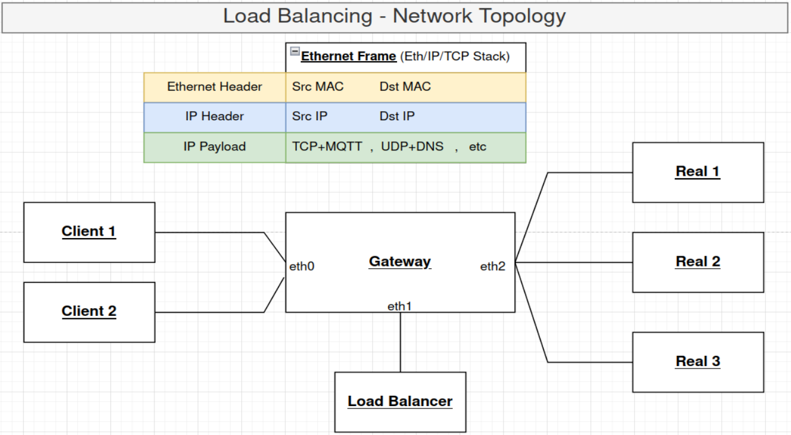

# eBPF Load Balancer
This project utilizes [katran](https://github.com/facebookincubator/katran) for use as a load balancer between MQTT clients and an MQTT cluster of brokers. It is currently under development. The used topology includes Katran LB, gateway, some clients and some reals/brokers. These services run into Docker containers that have a specific network connection as shown here.



The test was done on 
```txt
Operating System: Ubuntu 22.04.5 LTS              
Kernel: Linux 6.8.0-83-generic
Architecture: x86-64
```
The test was NOT successful on WSL / Windows environments. 
Be conscious if you try to test this in a host different than Ubuntu.
*Any attempt to run this compose project should be done on OSes running Linux kernel (check Katran Requirements for detailed info) due to the eBPF dependency.* 

## Docker setup

Docker Resources limits used:
```txt
CPU limit: 8
Memory Limit: 6 GB
Swap: 0 Bytes
Disk usage limit: 80 GB
```

On Ubuntu host execute:
```bash
git clone https://github.com/nickpapakon/load-balancer-eBPF.git
cd load-balancer-eBPF/lb-n-reals/
```
Ensure Docker Desktop is up and running and then, use a script that 
- builds the base images (e.g. `bpf_mqtt_base` is an ubuntu img containing most utilities needed for eBPF programs and MQTT messaging)
- does docker compose up for the containers
```bash
chmod +x ./docker-script.sh
./docker-script.sh
```
After this script completes (it may take 20-30 minutes), ensure all containers were built and run.

## Test

Experiments can be done using `lb-n-reals/experiment.sh` (explore environmental variables on `.env`)
Tests that contain multiple experiments, comparing the following  setups, are done using `lb-n-reals/test-*.sh` scripts:
- single broker
- Load Balancing using the eBPF Load Balancer
- Load Balancing using Shared Subscriptions
Load Balancer evolution and tests results have been kept inside `lb-n-reals/evolution/`. For a quick understanding, read the introduction and the last test done. You can switch to the appropriate branch to inspect the code and configuration at the time of each experiment. **Caution**: the operation of the setup depends on the `mqtt_LB` branch of the [forked Katran repo](https://github.com/nickpapakon/katran/tree/mqtt_LB) .

## Monitoring

- cAdvisor, Prometheus, Grafana containers can also run to gather and visualize the resources usage data for each container
- You can inspect measurements from completed experiments using the guide in `past_monitor`